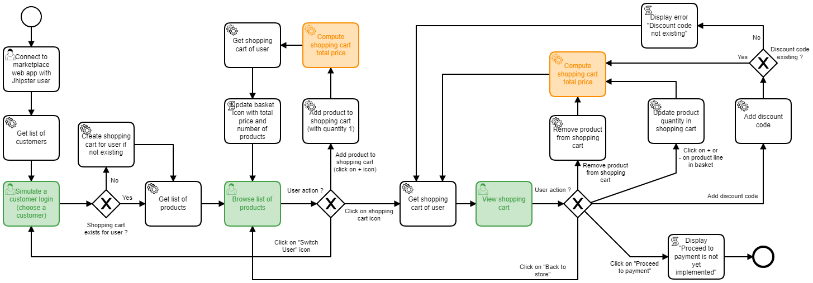
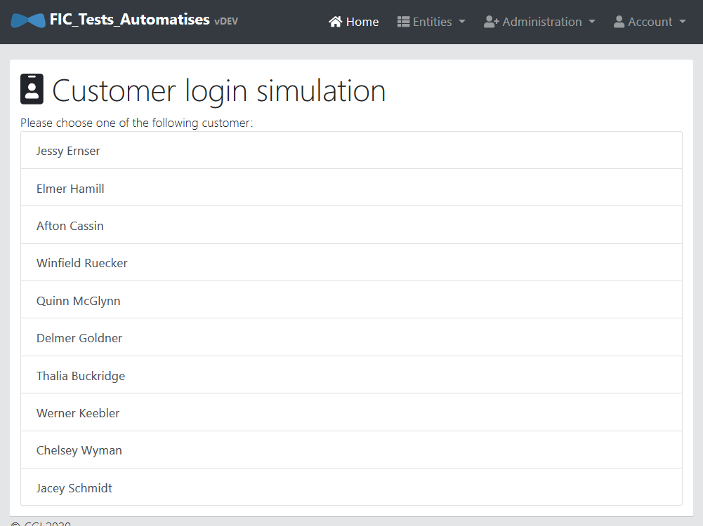
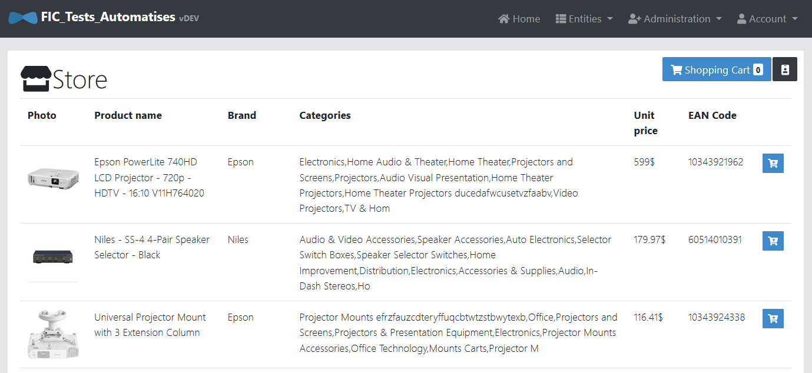
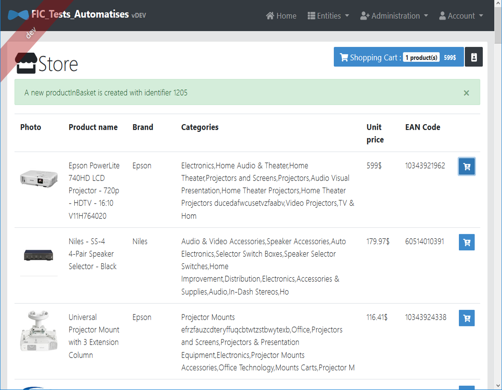
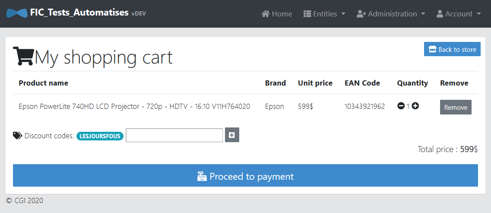
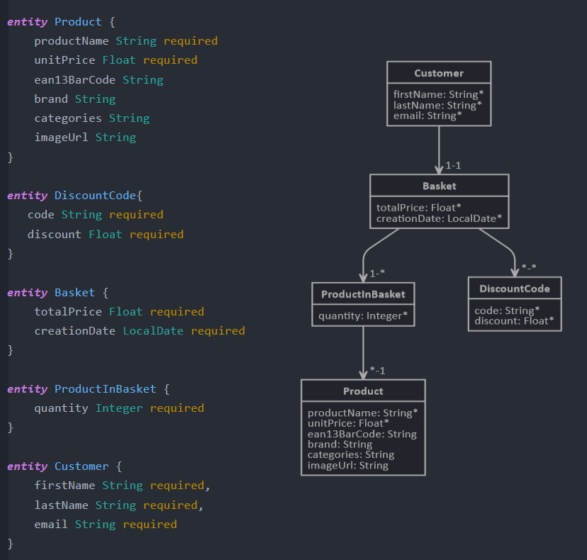
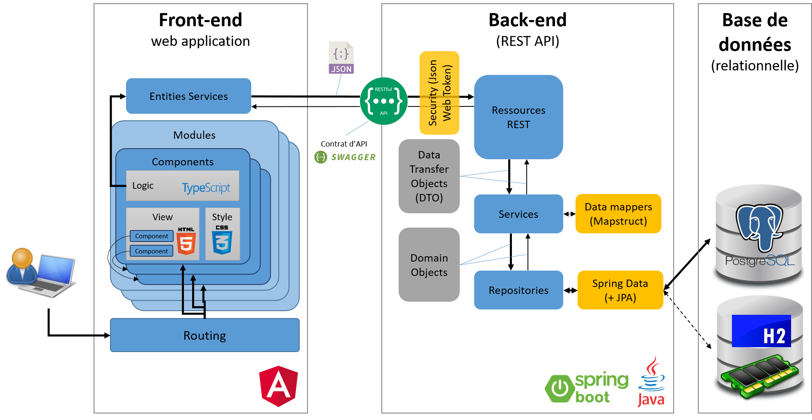

# Formation aux Tests Automatisés - mise en pratique

## 1. Présentation

### 1.1. Contexte

L'application qui va être utilisée pour se former à la réalisation de tests automatisés, est une implémentation très simplifiée d'un site web marchand, une marketplace électronique.
Vous allez vous focaliser sur la fonctionnalité d'ajout / retrait de produits dans un panier d'achat avec calcul du prix total du panier.

### 1.2. Processus

Le processus métier et technique de navigation dans l'application est décrit ci-dessous. Les 3 briques vertes correspondent aux 3 écrans de l'application. La brique orange est celle sur laquelle nous allons nous focaliser dans un premier temps (calcul du prix du panier).



#### 1.2.1. Ecran de sélection d'un client (simulation d'une connexion)

Cet écran permet de sélectionner un client et de simuler une connexion sur l'application.



#### 1.2.2. Ecran de liste des produits

Cet écran est une liste de produits électroniques qu'il est possible d'ajouter au panier d'achat. Sur chaque ligne un bouton + permet d'ajouter le produit au panier d'achat. En haut de page, le bouton bleu "Shopping Cart" permet d'accéder au panier d'achat, tandis que le bouton noir "Switch user" permet de sélectionner un autre client.



Une fois un produit ajouté au panier, le bouton bleu "Shopping cart" est mis à jour avec le nombre de produits sélectionnés et le coût total du panier.



#### 1.2.3. Panier de produit

Dans le panier de produit, il est possible :

- de supprimer des lignes du panier avec le bouton Remove de chaque ligne
- de mettre à jour la quantité avec les boutons + et -
- d'ajouter des codes de réduction grâce au champ texte "Discount codes"
- de retourner au magasin avec le bouton "Back to store"
- de procéder au paiement (non implémenté) avec le bouton "Proceed to payment"


Dans le panier de produit, il est possible :

- de supprimer des lignes du panier avec le bouton Remove de chaque ligne
- de mettre à jour la quantité avec les boutons + et -
- d'ajouter des codes de réduction grâce au champ texte "Discount codes"
- de retourner au magasin avec le bouton "Back to store"
- de procéder au paiement (non implémenté) avec le bouton "Proceed to payment"


### 1.3. Entités mises en oeuvre

Ce projet met en oeuvre 5 entités métier:

- l'entité **Product** (produit) qui matérialise un produit achetable
- l'entité **Discount Code** (code de réduction) avec le champ discount qui est le pourcentage de réduction applicable au panier
- l'entité **Basket** (panier d'achats) qui matérialise un panier d'achat et contient le champ "totalPrice" qui est calculé à partir des produits ajoutés au panier
- l'entité **ProductInBasket** (produit dans le panier) qui contient la liste des produits ajoutés au panier et leur quantité
- l'entité **Customer** (client) qui est la liste des clients de l'application

Les relations entre ces entités sont décrites dans le schéma ci-dessous:



### 1.4. Architecture de l'application

L'application a été construite avec [Jhipster](https://www.jhipster.tech/), un générateur d'application moderne. Elle est constitué de 3 blocs principaux:

- un front-end Angular qui est une application client riche web exécutée sur le poste de l'utilisateur
- un back-end sous forme d'API REST exécuté grâce à Spring Boot découpé en 3 couches principales (Ressources REST, services et couche d'accès aux données sous forme de Repository Spring Data)
- une base de données relationnelle PostgreSQL hébergée sur le cloud Azure comme un service managé.



## 2. Préparation

### 2.1. Compilation et lancement de l'application en mode développement

- Se connecter sur la VM attribuée par le formateur
- Lancer IntellijIDEA.
- Configurer la source de données en saisissant le mode de passe de l'utilisateur adminfic à la section YML `spring.datasource.password` dans les fichiers :
  - `src/main/resources/config/application-dev.yml`
  - `src/test/resources/config/application.yml`
- Lancer un premier terminal et taper la commande `npm start`
- Une fois que l'application front-end Angular est construite, la page web Market place simulation doit s'ouvrir dans le navigateur (à l'adresse [http://localhost:9000](http://localhost:9000)
- Dans l'onglet Terminal, cliquer sur + pour ouvrir un nouveau terminal.
- Dans ce nouveau terminal, lancer le front-end en tapant la commande `mnww`
- Vous pouvez ensuite vous connecter sur l'application en cliquant sur "Account" en haut à droite, puis sur "Sign in"
- Saisir "admin" comme login et "admin" comme password
- Vous arrivez ensuite sur la première page de l'application _Customer login simulation_
- A chaque modification de code (côte back-end en Java ou côté front-end en Angular), l'application est redéployée et peut être retestée dans le navigateur

### 2.2. Lancement des tests unitaires

Dans Intellij, il est possible de lancer l'ensemble des tests unitaires JUnit en procédant de la façon suivante:

- ouvrir `src/test/java`
- faire un clic droit sur `src/test/java` puis choisir `run` puis `All tests`. Il est aussi possible de lancer un sous-ensemble des tests en sélectionnant un sous-dossier de cette arborescence.
- une fois le projet compilé, un onglet `Run` apparaît sur le bas de l'écran et permet de lister l'ensemble des tests exécutés et le résultat associé
- vous devriez être capable de valider que l'ensemble des 117 tests disponibles passent avec succès.

### 2.3. Mesure de la couverture des tests unitaires

La mesure de la couverture des tests unitaires peut être effectuée de la même façon en sélectionnant l'option `Run all tests with coverage`, plutôt que `Run`. Si vous le faites, vous devriez obtenir une couverture d'au moins 85% des classes et 86% des lignes.

- Commencez par naviguer dans les classes du projet `com.cgi.fictestautomatises.productbasket`
- Les classes les plus importantes du projets sont dans les sous-dossiers `service` et `web` qui contiennent toute l'intelligence du projet. C'est là où un focus particulier doit être mis.
  > Quelles sont les classes qui mériteraient une meilleure couverture ?
  >
  >    <details>
  >    <summary>Solution</summary>
  > `web.rest.BasketResource` (79% de couverture de lignes) dont une méthode complète `addDiscountCode` n'est pas testée ET  `service.BasketService` avec 60% de couverture de méthodes
  >     </details>

## 3. Exercices

### 3.1. Tests exploratoires

Naviguez dans l'application, essayez toutes les fonctionnalités et procédez à des tests exploratoires.

> Quelles anomalies avez-vous détectée (2 ont été identifiées par les formateurs) ?
>
>    <details>
>    <summary>Solution</summary>
>    En cas d'ajout du même produit dans le panier, un doublon se crée au lieu d'incrémenter la quantité de cette référence.
>    Le calcul du panier ne prend pas en compte les bons de réduction qui sont ajoutés sur le panier.
>    </details>

### 3.2. Correction de l'anomalie de mise en panier d'un produit

#### 3.2.1. Tests Unitaires

Nous proposons de corriger l'anomalie que vous avez dû détecter lors de l'ajout d'un produit dans le panier.

> Comment allez-vous procéder ? Quelle méthodologie voulez-vous adopter ?
>
>    <details>
>    <summary>Solution</summary>
>    Le Test Driven Development est particulièrement adapté à la prise en compte d'anomalies puisqu'il sécurise le développement existant et s'assure que l'anomalie ne sera pas reproduite à l'avenir (non-régression)
>    </details>

Nous vous proposons désormais d'analyser le code correspondant à cette anomalie.

> Quelles sont les méthodes concernées ?
>
>    <details>
>    <summary>Solution</summary>
>    La méthode web.rest.ProductInBasketResource.createProductInBasket  appelle la méthode service.ProductInBasketService.save qui appelle repository.productInBasketRepository.save
>    </details>

Après analyse, pensez-vous que l'organisation du code actuelle vous permet-elle d'implémenter ce nouveau contrôle de façon adéquate.

> Quelle réorganisation (refactoring) proposez-vous ?
>
>    <details>
>    <summary>Solution</summary>
>     Implémenter une nouvelle méthode addProductToBasket dans la classe de service (ProductInBasketService). Cette méthode procède au contrôles fonctionnels (dont le contrôle de doublon) et appelle la méthode save de ce même service. Dans la classe rest, il faudra donc appeler la méthode addProductToBasket du service.
>    </details>

Commencez par développer les tests nécessaires

>    <details>
>    <summary>Pistes</summary>
>     Creer une nouvelle classe que vous nommerez, idéalement, ProductInBasketServiceIT.java, dans le repertoire src/test/java et dans le package com.cgi.fictestautomatises.productinbasket.service .
>     Implementer une méthode init() annotée avec @BeforeEach qui permettra d'initialiser les données nécessaires pour chaque tests que vous allez developper.
>     N'hesitez pas à vous inspirer du fichier UserServiceIT.
>     Créer et implementer la fonction de test, addProductInBasketTest.     
>    </details>

Exécutez plusieurs fois votre test et observez le fonctionnement.

> Votre test répond-il aux critères du RIP ?
>
>    <details>
>    <summary>Solution</summary>
>     Non, car ces tests ne sont pas isolés puisqu'ils dépendent de services d'accès aux données (PostgreSQL). 
>     Il est donc nécessaire de mocker ces services.
>    </details>

#### 3.2.2. Isolation des tests par du code

Comment procéder ?

> Soit implémenter une interface (Repository
> public ProductInBasketService(ProductInBasketRepository productInBasketRepository, BasketService basketService, ProductInBasketMapper productInBasketMapper)
>
> - ProductInBasketRepository est une interface qu'on peut implémenter soit-même (mock manuel)
> - BasketService est une classe qu'on peut mocker de 2 manières différentes
>   - par magie avec Spring @Mock
>   - avec Mockito
> - Le mapper sert à convertir un ProductInBasketDTO (POJO exposé par l'API REST) vers un ProductInBasket (classe model utilisé par la persistence), ce n'est pas utile de le mocker. Il n'a pas d'influence négative sur les tests. Par contre, il est testé par cette méthode.

#### 3.2.3. Test de service avec base de données en mémoire

Dans cet exercice-là, il faudra passer tout le module de test sur une base en mémoire.
Le test se fait alors différemment. On appelle la méthode sans mocker le repository. On vérifie après test que la base de donnée ne contient qu'un seul enregistrement et non pas deux.

Avantages / Inconvénients de cette méthode:

- Avantages: plus simple à coder
- Inconvénient: on simule une base PostgreSQL avec H2, est-ce que le comportement sera exactement le même ?
- Inconvénient: besoin de données de référence et d'une base H2 initialisée avec la structure des tables (chargées automatiquement avec liquibase)

### 3.3. Behavior Driven Development

Implémenter la prise en compte des codes de réduction en mode Behavior Driven Development

- Rédiger un document .feature en respectant given when then
- Lancer les tests unitaires sur CucumberIT.java
- Créer une nouvelle classe de test dans src/test/java/.../Cucumber/StepDefs
- Copier coller l'étape à implémenter dans cette nouvelle classe
- L'implémenter

### 3.4. Tests d'intégration d'IHM avec RobotFramework et Selenium

A définir

---

## Jhipster documentation (development guide)

This application was generated using JHipster 6.6.0, you can find documentation and help at [https://www.jhipster.tech/documentation-archive/v6.6.0](https://www.jhipster.tech/documentation-archive/v6.6.0).

Before you can build this project, you must install and configure the following dependencies on your machine:

1. [Node.js][]: We use Node to run a development web server and build the project.
   Depending on your system, you can install Node either from source or as a pre-packaged bundle.

After installing Node, you should be able to run the following command to install development tools.
You will only need to run this command when dependencies change in [package.json](package.json).

    npm install

We use npm scripts and [Webpack][] as our build system.

Run the following commands in two separate terminals to create a blissful development experience where your browser
auto-refreshes when files change on your hard drive.

    ./mvnw
    npm start

Npm is also used to manage CSS and JavaScript dependencies used in this application. You can upgrade dependencies by
specifying a newer version in [package.json](package.json). You can also run `npm update` and `npm install` to manage dependencies.
Add the `help` flag on any command to see how you can use it. For example, `npm help update`.

The `npm run` command will list all of the scripts available to run for this project.

## Building for production

### Packaging as jar

To build the final jar and optimize the FIC_Tests_Automatises application for production, run:

    ./mvnw -Pprod clean verify

This will concatenate and minify the client CSS and JavaScript files. It will also modify `index.html` so it references these new files.
To ensure everything worked, run:

    java -jar target/*.jar

Then navigate to [http://localhost:8080](http://localhost:8080) in your browser.

Refer to [Using JHipster in production][] for more details.

### Packaging as war

To package your application as a war in order to deploy it to an application server, run:

    ./mvnw -Pprod,war clean verify

## Testing

To launch your application's tests, run:

    ./mvnw verify

### Client tests

Unit tests are run by [Jest][] and written with [Jasmine][]. They're located in [src/test/javascript/](src/test/javascript/) and can be run with:

    npm test

For more information, refer to the [Running tests page][].

### Code quality

Sonar is used to analyse code quality. You can start a local Sonar server (accessible on http://localhost:9001) with:

```
docker-compose -f src/main/docker/sonar.yml up -d
```

You can run a Sonar analysis with using the [sonar-scanner](https://docs.sonarqube.org/display/SCAN/Analyzing+with+SonarQube+Scanner) or by using the maven plugin.

Then, run a Sonar analysis:

```
./mvnw -Pprod clean verify sonar:sonar
```

If you need to re-run the Sonar phase, please be sure to specify at least the `initialize` phase since Sonar properties are loaded from the sonar-project.properties file.

```
./mvnw initialize sonar:sonar
```

or

For more information, refer to the [Code quality page][].

## Using Docker to simplify development (optional)

You can use Docker to improve your JHipster development experience. A number of docker-compose configuration are available in the [src/main/docker](src/main/docker) folder to launch required third party services.

For example, to start a postgresql database in a docker container, run:

    docker-compose -f src/main/docker/postgresql.yml up -d

To stop it and remove the container, run:

    docker-compose -f src/main/docker/postgresql.yml down

You can also fully dockerize your application and all the services that it depends on.
To achieve this, first build a docker image of your app by running:

    ./mvnw -Pprod verify jib:dockerBuild

Then run:

    docker-compose -f src/main/docker/app.yml up -d

For more information refer to [Using Docker and Docker-Compose][], this page also contains information on the docker-compose sub-generator (`jhipster docker-compose`), which is able to generate docker configurations for one or several JHipster applications.

**Links**:
[jhipster homepage and latest documentation]: https://www.jhipster.tech
[jhipster 6.6.0 archive]: https://www.jhipster.tech/documentation-archive/v6.6.0
[using jhipster in development]: https://www.jhipster.tech/documentation-archive/v6.6.0/development/
[using docker and docker-compose]: https://www.jhipster.tech/documentation-archive/v6.6.0/docker-compose
[using jhipster in production]: https://www.jhipster.tech/documentation-archive/v6.6.0/production/
[running tests page]: https://www.jhipster.tech/documentation-archive/v6.6.0/running-tests/
[code quality page]: https://www.jhipster.tech/documentation-archive/v6.6.0/code-quality/
[setting up continuous integration]: https://www.jhipster.tech/documentation-archive/v6.6.0/setting-up-ci/
[node.js]: https://nodejs.org/
[yarn]: https://yarnpkg.org/
[webpack]: https://webpack.github.io/
[angular cli]: https://cli.angular.io/
[browsersync]: https://www.browsersync.io/
[jest]: https://facebook.github.io/jest/
[jasmine]: https://jasmine.github.io/2.0/introduction.html
[protractor]: https://angular.github.io/protractor/
[leaflet]: https://leafletjs.com/
[definitelytyped]: https://definitelytyped.org/
